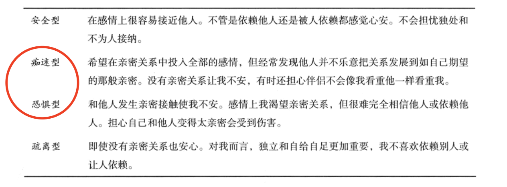
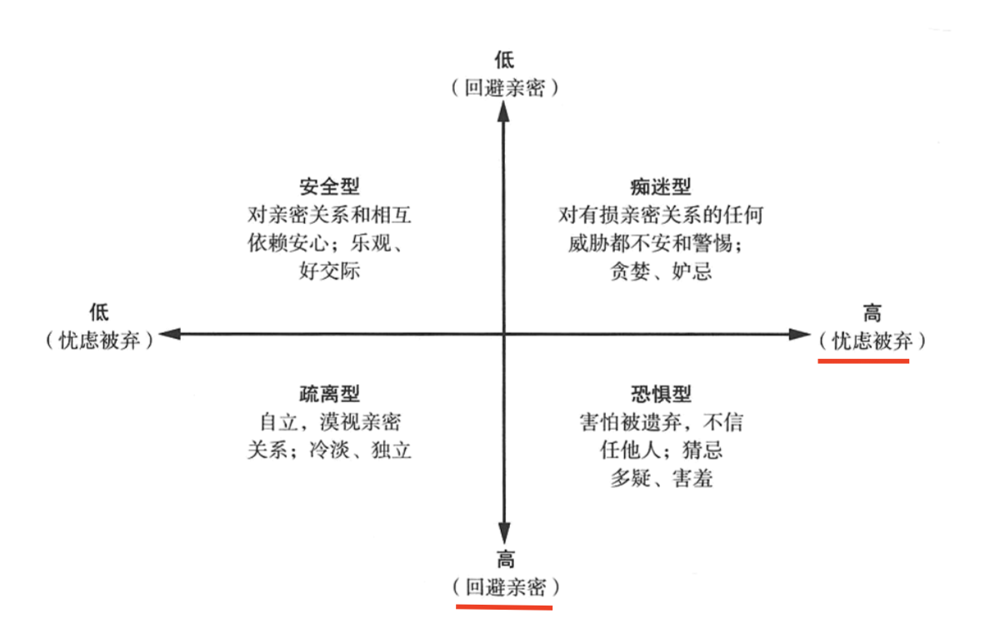
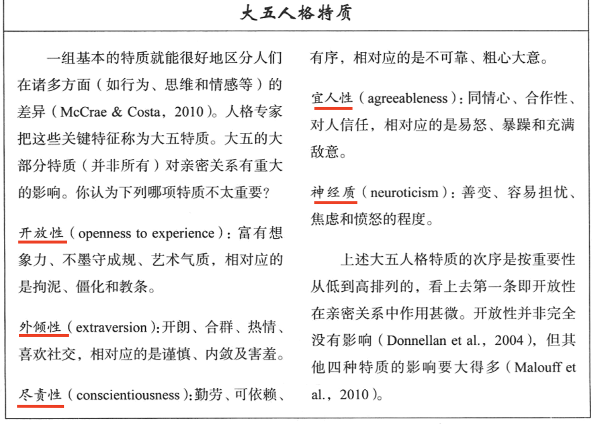

# 第一章 人际关系的构成

## 亲密关系的性质

**亲密关系**和**泛泛之交**至少在六个方面存在程度差异：

 1. **了解(knowledge)**。亲密的伴侣彼此间有着广泛而私密的*了解*。他们熟知彼此的经历、爱好、情感和心愿，一般不会把这些信息透露给其他人。
 2. **关心(care)**。亲密的伴侣*关心*对方，彼此能从对方身上感受到更多的关爱。
 3. **相互依赖性(interdependence)**是指亲密的伴侣彼此需要的程度和影响对方的程度，这种互相依赖是频繁的（经常影响彼此）、强烈的（彼此都有显著的影响）、多样的（以多种不同的方式影响彼此）和持久的（彼此影响的时间很长）
 4. **互相一致性(mutuality)**，这意味着亲密的伴侣认同双方在生活上的融合，自称为“我们”，而不是“我”或者”他/她“。
 5. **信任（trust)**, 亲密的伴侣期望对方会善待和尊重自己。
 6. **承诺(commitment)**，亲密的伴侣会*承诺*他们的亲密关系，希望他们的关系能持续到地老天荒，并为此不惜投入大量的时间、人力和物力。

## 归属需要

个体需要的亲密关系无需太多，几个便可。归属需要得到满足后，我们建立人际关系的内驱力就会降低（因而人际关系的质量比数量更重要）。

当人们长期处在极度孤单的状态时，会表现出强烈的紧张应激反应；任何对亲密关系构成威胁的事物，都让人难以接受。

**两则趣闻**：

> 1. 具有亲密关系的人较之单身生活的人更幸福、健康、长寿。
> 
> 2. 当大学生孤独无伴时，免疫反应会变弱，更容易患上感冒或流感。

我们的幸福感看来取决于归属需要的满足程度。**归属需要是人类长期演化的产物，逐渐成为所有人共同的自然倾向**。这种观点的逻辑：早期人类生活环境恶劣，与他人建立稳定持续而充满关爱的人际关系，更有利于生存和繁衍。结果人类的特质演化成：**十分在乎他人对自己的看法，并极力寻找他人的认同和亲密接触**。

### 决定人际关系构建的因素

#### 1. 文化的影响

文化标准是人们建立人际关系的基石，它影响着人们对人际关系的期望，限定了正常的人际关系模式。

同居增加了夫妻离婚的危险。原因：同居情侣彼此的承诺一般不如已婚夫妻，所以同居情侣比已婚夫妻经常面临更多的问题和不确定性。

人们同居的时间越长，对婚姻的热情越低，越容易离婚。

**支配亲密关系规范的因素**:

1. **经济发展水平**。工业化程度越高，越富足，越能接纳单身，包容离婚和晚婚。
2. **个人主义(支持自我表现，重视个人成就)**。
3. **新科技**。
4. **特定文化下的青年男女的想对数量**。高性别比率的社会（女性较少）倾向于支持男主外女主内的性别角色。低性别比率的社会（男性较少）倾向于鼓励妇女外出工作以自立。

#### 2. 个人经历的影响

这四种依恋类型可以在两个维度的基础上区分：**回避亲密(avoidance of intimacy)** 和 **忧虑被弃(anxiety about abandonment)**。

恐惧型的人则两者皆有，在亲密关系中坐立不安又担心亲密关系不能长久。

安全型的妈妈往往有安全型的孩子，而不安全型的妈妈则往往也有不安全型的孩子。

依恋类型是习得的，就可能发生变化。一次悲痛欲绝的分手会让原本安全性的人不再安全，一段如胶似漆的恋情也能慢慢让会比亲密的人不再怀疑和戒备亲密感情。在两年内，足有三分之一的依恋类型可以发生实质性变化。

#### 3. 个体差异的影响

在爱情关系中，情侣双方某些依恋类型的匹配可能比其他的匹配要好得多。假若痴迷型的人爱上了疏离型的人，就产生了依恋类型的不匹配。痴迷型的人会因对方的感情疏远而气馁，而疏离型的人则会因为对方的依赖和干涉而烦恼。双方都不如与安全型的爱人相处时轻松。

**四种不同类型的个体差异：**

1. **性别差异**。 从整体来看，两性差异虽然存在，但非常小。
2. **性认同差异**。性认同差异是指由文化和教育引起的两性在社会性和心理上的差异。
3. **人格差异**。 大五人格特质：开放性、外倾性、尽责性、宜人性、神经质。
4. **自尊差异**。

性认同最好的例子是**性别角色**，即社会文化所期待的男女两性应有的“正常”行为模式。“男子气”(**工具性特质**): 自信、独立、果敢、能干、好强。 “女人味”(**表达性特质**): 热情、敏感、多情、友善。

低工具性的人（缺乏自信和个人魄力的人)往往不如那些高工具性的人（任务导向的技能高的人)自尊程度高和使用能力强。在“应对事务”上有能力和效率的人通常自我感觉良好。

工具性和表达性都是有价值的特质，幸福、适应能力强、有效率和心理健康的认识通常都同时拥有这两组技能。

**大五人格特质**：

尽责心不够的人会透支他们的信用......取消计划、怨天尤人、疏懒嗜睡、违背承诺。因此他们往往是不可靠的伴侣。

人格影响人际关系的程度远大于人际关系影响人格的程度。

#### 4. 自尊

自尊是人们的主观计量器，即“**社会关系测量仪**”，可以测量我们的人际关系质量。

**自尊是满足我们归属需要演化而来的机制**。我们从他人那里感受到的尊重明显地影响到随后的自我评价。如果他人不喜欢我们，我们要喜欢自己非常困难。

低自尊的人有时低估伴侣对他们的爱，以致损害亲密关系，还觉知到根本就不存在的伴侣忽视。自我评价低的人很难相信伴侣会真正深深的爱上自己，结果，他们往往都对持续的爱情不乐观。低自尊者“即使处在亲密关系之中也往往（毫无根据地）认为伴侣对自己的感情非常不可靠”，这又使他们对伴侣偶尔糟糕的情绪反应过度。

当亲密关系出现挫折时，自我评价高的人却能拉近和伴侣的距离，努力修复亲密关系，低自尊的人则防御性的把自己隔离起来，生闷气，乱搞一通，还觉得自己更加糟糕。**低自尊的人总把他们脆弱的自尊心置于亲密关系之上**。

低自尊好像既来自于人际关系，又影响着随后发生的人际关系。

#### 5. 人类本性的影响

演化经历无数带塑造着我们的人际关系，潜移默化的使每个人都表现出一定的倾向性。

演化心理学三个基本假设：

1. 性选择使人类成为今天这样的物种。
2. 两性之所以存在差异，只是因为某种程度上他们在过去面临着不同的繁殖困境。
3. 文化影响决定了演化形成的行为模式是否具有适应性 —— 并且文化的变化比演化快得多。

男女双方在生养孩子上的**养育投入**的生物学差别，引起了男女双方在选择配偶时进化出不同的策略。考虑到女性的繁殖能力有限，认真挑选配偶的女性祖先繁殖就更成功。一般而言，当男人想确立长期的亲密关系时，比女人更看重外貌，随着年纪增长，老男人更加喜欢与更年轻的女子结婚。而女性比男性更关注长期伴侣的经济前景和社会地位。

#### 6. 人际互动的影响

明确而清晰的互动模式就能区分各种不同的人际关系类型。但是在任一特定时刻，人际关系可能是一种不稳定的存在，它是人类复杂互动活动变化的结果。

#### 人际关系的消极面

当人们与他人接近时，可能害怕自己最在乎的秘密被人揭露或利用。他们还可能担忧伴随相互依赖而来的自主性和自我控制的丧失。

为什么人类还要冒这种风险？**因为我们人类是社会化的动物，我们需要彼此。没有与他人的亲密联系，我们就枯萎和死亡。**